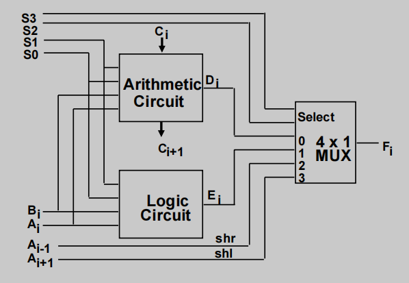
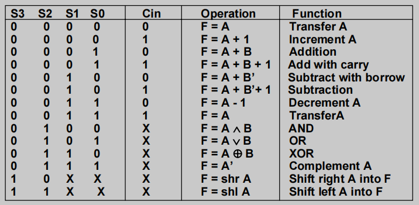

## Verilog code of a 4-bit Arithnetic Logic Shift Unit with testbench

Here is verilog code of a 44-bit Arithnetic Logic Shift Unit with testbench module like the picture below:  
 

 
with status table like:  

